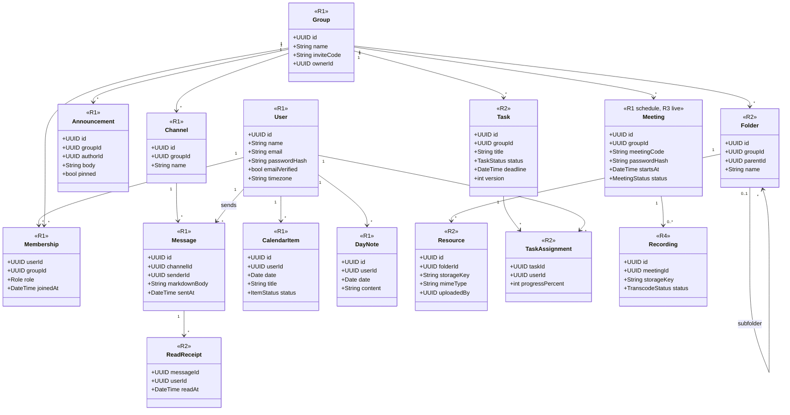

# SyncUp: Project Brief (v2)

> Paste this whole document at the start of a new AI chat, then ask your question.
> Last updated: 4 Oct 2026. Supersedes v1. Items marked ASSUMPTION or OPEN are not yet confirmed by the team.

## 0. Instructions for the AI reading this

You are a senior engineer and mentor for a 5-person student team running this project as a self-organized internship. They want production-level work and real industry practice, not tutorial shortcuts.

- Respect the decisions below. If you disagree with one, explain why instead of silently changing it.
- Prefer simple solutions suited to 5 people. No microservices or heavy infrastructure before they are needed.
- Name industry practices where they apply (PR review, tests, CI, migrations, ADRs) and briefly say why.
- State risks and trade-offs. Ask at most one clarifying question when a decision depends on missing information.
- Out of scope for now: code editor, code execution, specialized group types (DSA, gaming, etc.), LLM/RAG features, native mobile app.
- When producing diagrams, output Mermaid or PlantUML text so it can be stored in the repo under `docs/`.

## 1. Product

SyncUp is one place where any group can chat, share files, assign and track tasks, plan their days, and meet. It replaces the juggling of Discord/Slack, Zoom/Meet, Notion/Drive and Trello/Jira. Website first, mobile app later. LLM/RAG ideas come only after the core product is complete.

Goals: help groups coordinate efficiently, ship a production-level product, and give the team real industry experience in web development and system design.

## 2. Team and process

- 5 people, self-run internship, agile throughout. Working hours assumption: about 8 to 10 hours per week each (ASSUMPTION).
- **Sprint length: 2 weeks.** Sprint 0 is 1 week (setup).
- Ceremonies: planning (about 1 h), daily standup (15 min, or async), review + retrospective (about 1.5 h).
- Backlog of user stories with acceptance criteria in GitHub Projects (or Jira).
- Definition of Done: reviewed, tested, merged to `main`, deployed to staging, docs updated.
- Rotate Scrum Master, sprint tech lead and QA owner each sprint. Reserve 15 to 20 percent of each sprint for tech debt.
- Time-box unknowns as 2-day spikes before estimating (e.g., WebRTC).

## 3. Releases

| Release | Features |
|---|---|
| R1 Core | Sign up/log in, profile, create/join groups (invite code), roles, announcements, group chat, calendar with daily notes |
| R2 Collaboration | Resource vault (folders, upload, download), Kanban task board (assignees, deadlines, progress), read/unread status |
| R3 Meetings | Join meeting by ID + password, small-group audio/video (WebRTC), scheduled meetings in calendar |
| R4 Scale | Recording + transcoding, caching, event queue, monitoring, mobile app |

Main screens: auth (sign up, log in) then a main page with Calendar (per day: done / to do / remaining, revision notes, join meeting by ID + password), Groups (each group has chat, resources, announcements, meet/call), and Profile.

Product gaps to cover over time: email verification, password reset, notifications (in-app first), search in a group, onboarding empty states, leave group / remove member / report / delete account, accessibility.

## 4. Roles (per group)

- **Owner:** everything, including change roles and delete group.
- **Admin:** manage members, announcements, assign tasks, manage folders. Inherits all Member abilities.
- **Member:** create/join/leave group, chat, write own day notes, view calendar, upload files, update own task, join meeting.
- **Visitor** (not logged in): sign up, log in, reset password.
- Roles belong to a group: one person can be Owner of one group and Member of another. Groups are joined with an invite code.

ASSUMPTIONS (confirm): any user can create a group; members can upload files; calendar notes are private; calendar items are personal plus group meetings.

## 5. Technical decisions

- **Architecture:** modular monolith. One backend with modules: auth, groups, chat, resources, tasks, calendar. Split into services later only for a concrete reason.
- **Frontend:** Next.js, TypeScript, Tailwind. Zustand or Redux Toolkit; optimistic updates; list virtualization for long chat/file lists.
- **Backend:** Node.js + TypeScript (ASSUMPTION, recommended: one language for everyone).
- **Data:** PostgreSQL (source of truth), Redis (cache, real-time support), S3-compatible storage with pre-signed URLs for files.
- **Real-time:** Socket.io for chat/live updates with auto-reconnect. WebRTC + STUN/TURN in R3 (peer-to-peer fine for about 4 to 6 people; larger calls need a media server).
- **Concurrency:** `version` column on tasks (optimistic locking) or row locks.
- **Dates:** store timestamps in UTC, convert to the user's timezone in the browser.
- **Tooling:** Docker (installed on the team's Linux machines), GitHub Actions CI/CD.
- **Later (R4):** Kafka or RabbitMQ, Terraform, Prometheus + Grafana, FFmpeg workers.

## 6. Engineering standards

- **Code:** feature branches, PRs with at least 1 reviewer, no direct pushes to `main`, conventional commits, CI on every PR (lint, types, tests, build), preview deploys when possible.
- **Testing:** unit tests, API integration tests against a test DB, a few Playwright E2E tests for critical flows. No feature is done without tests.
- **Environments/data:** local, staging, production. No secrets in the repo (`.env.example` only). Versioned DB migrations only. Automated backups and one practice restore.
- **Security:** hashed passwords, access/refresh tokens, input validation (e.g., Zod), tested authorization checks per group, rate limiting on login and messaging, dependency and secret scanning.
- **Observability:** structured logs with request IDs, Sentry, health-check endpoint, uptime monitoring; dashboards later.
- **Docs:** API-first (OpenAPI before endpoints), ADRs, diagrams in `docs/`, README (new person running in under 15 min), CONTRIBUTING, runbook, changelog + version tags, one-page design doc before big features, blameless postmortems, feature flags.
- Adoption order: Sprint 0-1 git workflow/CI/README/ADRs/migrations; R1 tests/validation/auth security/staging/Sentry; R2 E2E/feature flags/logging/notifications/search; R3 WebRTC spike/load tests/runbook; R4 queue/caching/Prometheus/Terraform/mobile. Do not adopt everything at once.

## 7. Work split (proposed, by feature)

1. Foundation, auth, DevOps: repo, CI/CD, environments, login, profile
2. Groups and announcements: groups, roles, invites, announcements
3. Real-time chat: sockets, message storage, later WebRTC
4. Calendar and notes: daily view, notes, scheduled meetings
5. Resources and task board: file vault, Kanban, progress

Each person owns a feature from UI to database. OPEN: assign names. OPEN: who owns the media pipeline (pre-signed uploads, FFmpeg) in R3/R4.

## 8. Sprint 0 setup checklist

1. GitHub repo, branch protection on `main`, PR and issue templates.
2. Layout: `apps/web`, `apps/api`, `docs/`, `infra/`.
3. Node LTS (nvm), pnpm, TypeScript, ESLint, Prettier, pre-commit hook.
4. `docker-compose.yml` for Postgres + Redis, plus `.env.example`.
5. GitHub Actions CI: lint, type-check, tests, build.
6. Project board with backlog and Sprint 0 tasks.
7. Written working agreement: sprint dates, standup time, review rules, Definition of Done, communication channel.
8. README, CONTRIBUTING, ADR folder, diagrams folder. First ADRs: modular monolith, Node/TypeScript, PostgreSQL.
9. Wireframes for auth, main page, groups, profile.

## 9. Sprint 1 draft (2 weeks): frontend shell with mock data, backend groundwork in parallel

Frontend stories:
1. Visitor can sign up and log in (validation, error states).
2. Main page with navigation: Calendar, Groups, Profile.
3. Calendar: pick a day, see done / to do / remaining and a notes field.
4. Join meeting by ID + password (form and validation only).
5. Groups list; each group has tabs Chat, Resources, Announcements, Meet (placeholders).
6. Profile page.
7. Responsive and keyboard-accessible layout.

Backend groundwork: draft DB schema and first migration, draft OpenAPI contract for auth and groups, register/login endpoints with tests if time allows.

Goal: a clickable, well-designed shell the team and a few friends can try, with contracts ready so Sprint 2 connects real data.

## 10. Learning plan

- **Everyone now:** Git/GitHub workflow, Docker basics (images, containers, volumes, Compose), HTTP and REST, Linux terminal, VS Code with ESLint/Prettier, an API client (Postman or Bruno), `.env` handling, dates and time zones.
- **Frontend (Sprint 1):** TypeScript, React (components, props, state, hooks), Next.js (routing, layouts), Tailwind, accessible forms.
- **Backend (Sprint 1-2):** TypeScript on Node, an HTTP framework (Express, Fastify or NestJS), SQL and PostgreSQL (joins, indexes, transactions), authentication (hashing, sessions/JWT, refresh tokens), validation, API tests.
- **Later:** WebSockets/Socket.io (R1 chat), Redis (R2), WebRTC (R3), queues and monitoring (R4).
- **Team skills:** clear PR descriptions, constructive code review, ask for help after about 30 minutes stuck, pair programming on hard problems, system design basics (client-server, stateless servers, caching, indexes) as features need them.
- Learn just enough to build the next feature, time-boxed to a few days per topic.

## 11. UML plan and status

| # | Diagram | Status |
|---|---|---|
| 1 | Use case | Draft done (summarized in section 4) |
| 2 | Class diagram | Draft v2 done (below); three open questions |
| 3 | Component diagram | TODO: redraw for modular monolith (UI, API modules, Socket.io, Postgres, Redis, S3) |
| 4 | ER diagram | TODO: derive from class diagram |
| 5 | Sequence diagrams (R1) | TODO: sign up/login, create/join group by invite code, send chat message (real-time), add day note |
| 6 | State diagrams | Later: Task, Meeting, Recording status |
| 7 | Deployment diagram | Later: local, staging, production |

Detail only the current release; do not draw R3 sequences months early.

Use case relationships: Admin inherits Member; Owner inherits Admin.

### Class diagram v2 (Mermaid source)

Design notes: `Membership` resolves the User-Group many-to-many and holds the role. `Task.version` supports optimistic locking. Files and recordings store only a `storageKey` (bytes live in object storage). `CalendarItem` is many per day; `DayNote` is one per user per day.

## 12. Open decisions

1. Class diagram questions: one default `Channel` per group in R1, or multiple channels? Are calendar items personal only, or do group tasks/meetings appear automatically? Can messages be edited/deleted (add `editedAt`, `deletedAt`)?
2. Roles/permission assumptions in section 4.
3. Backend language (recommended Node + TypeScript); ORM/migration tool (Prisma or Drizzle).
4. Hosting for staging and production.
5. Sprint start date, R1 target date, weekly hours per person.
6. Owners for the five areas; owner of the media pipeline.

## 13. Immediate next steps

1. Team reviews sections 4 and 12 and settles the open decisions.
2. Do the Sprint 0 checklist (section 8).
3. Finish UML: component diagram, then ER diagram, then R1 sequence diagrams (section 11).
4. Write Sprint 1 as full user stories with acceptance criteria and estimates.
5. Ask the AI to generate `docker-compose.yml` (Postgres + Redis) and a repo folder structure.

## 14. Original charter (summary)

Five modules: Hub (dashboard with feed, pinned announcements, upcoming meets), Live Chat (multi-channel, markdown, read/unread sync), Resource Vault (folders, upload/stream/download), Sprint Board (Kanban with live progress), Meet Chamber (WebRTC calls plus async recording and transcoding). Constraints: concurrency control on edits, sub-second real-time updates, caching of frequently read data. It proposed 7 to 8 engineers split by layer; this brief adapts it for 5 engineers split by feature.
